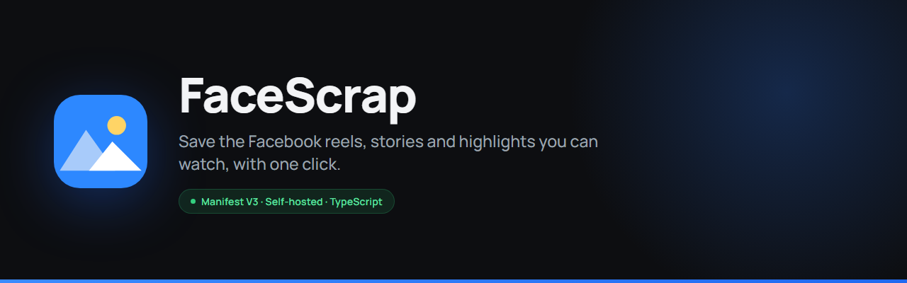
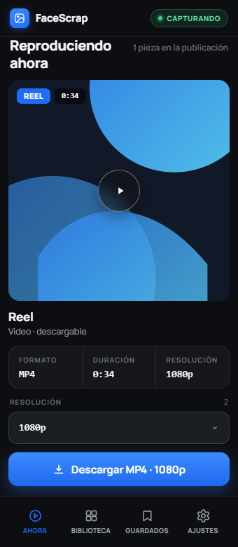
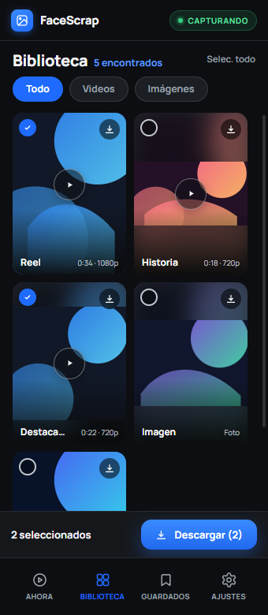
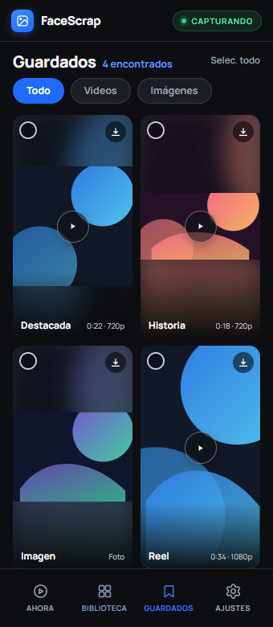
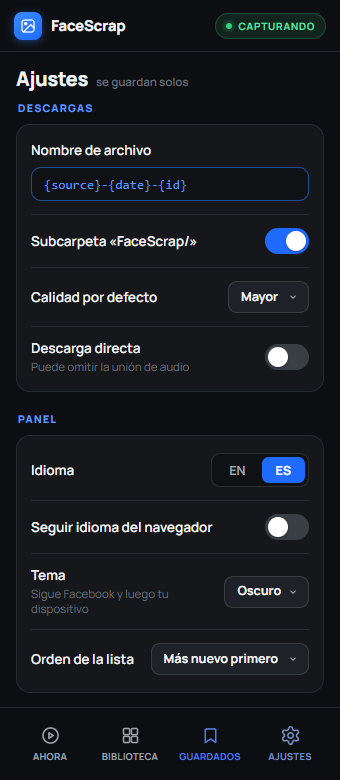
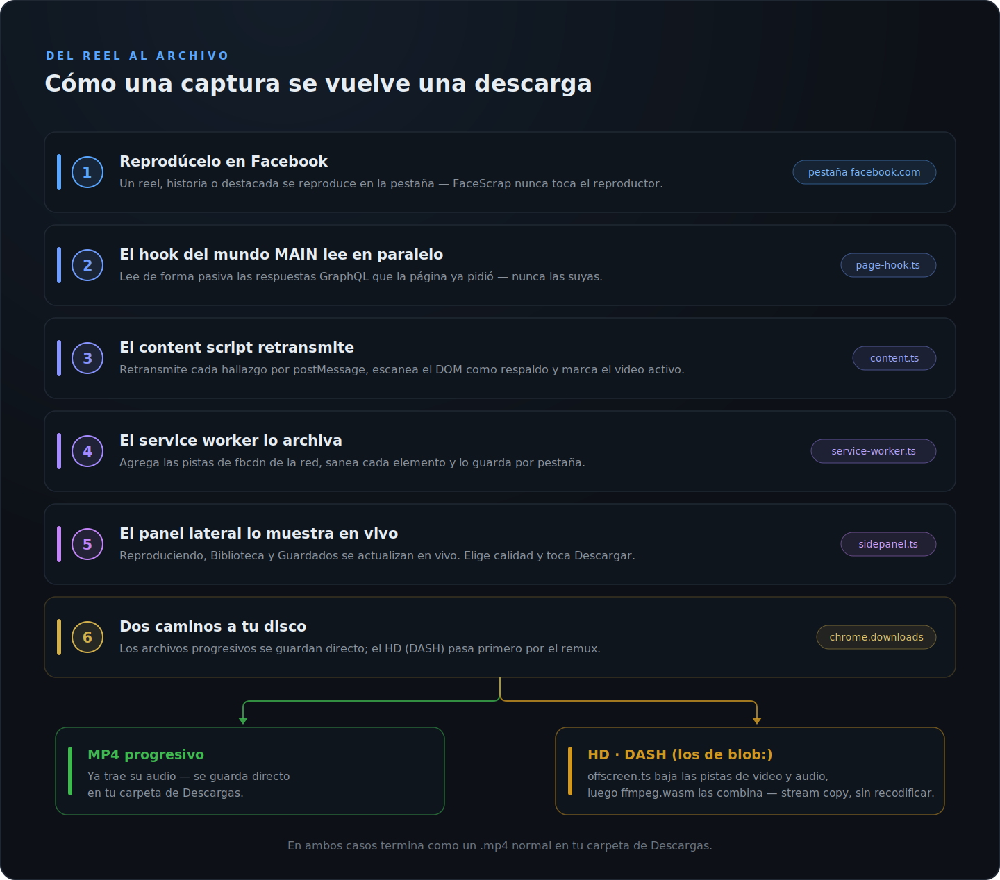

# FaceScrap

[English](README.md) · **Español (México)**

<p align="center">
  
</p>

[](https://github.com/Hydza/FaceScrap/actions/workflows/ci.yaml)
[](https://github.com/Hydza/FaceScrap/releases/latest)
[](manifest.json)
[](#compatibilidad-con-navegadores-chromium)
[](package.json)
[](LICENSE)

Guarda con un clic los **reels, historias y destacadas** de Facebook que puedes
ver. Extensión de Chrome (Manifest V3, TypeScript). **Autoalojada** — la compilas
o descomprimes y la cargas sin empaquetar; no está en la Chrome Web Store.

> ⚠️ Descarga solo contenido sobre el que tengas derechos (el tuyo, o con
> permiso). Los Términos de Meta prohíben la descarga automatizada, por eso esto
> **no puede publicarse** en la Chrome Web Store, y depende de detalles internos
> de Facebook que cambian seguido (espera mantenimiento más o menos mensual —
> vigila la página de [Releases](https://github.com/Hydza/FaceScrap/releases)
> para las actualizaciones).

> **Qué puede acceder.** Cargar FaceScrap le concede un content script en cada
> página de `facebook.com` (`document_start`) y acceso de red a `facebook.com` y
> `fbcdn.net`. Solo lee lo que esas páginas ya cargan, guarda las capturas en el
> almacenamiento de sesión por pestaña, y no envía nada a ningún servidor propio.
> Revisa [el código](src/) antes de instalar — de eso se trata autoalojar.

<p align="center">
  
  
  
  
</p>
<p align="center"><i>Ahora · Biblioteca · Guardados · Ajustes</i></p>

## Cómo funciona

1. Un **service worker** observa el tráfico de red hacia `*.fbcdn.net`
   (webRequest no bloqueante) y registra el contenido por pestaña en
   `chrome.storage.session`.
2. Un **hook del mundo MAIN** (`page-hook.js`) lee de forma pasiva las respuestas
   GraphQL que el propio Facebook pide (nunca reenvía las consultas `doc_id`, que
   Meta rota cada 2–4 semanas) y extrae `playable_url` (video con audio) e
   `image.uri`.
3. Un **content script** aislado escanea el DOM (`<video>`, ``, poster) como
   respaldo y retransmite todo al service worker.
4. El **panel lateral** presenta las capturas de la pestaña activa en tres vistas
   — Ahora, Biblioteca, Guardados — y descarga mediante `chrome.downloads`
   (a los videos HD se les une el audio en un documento offscreen).
   **Ahora** se centra en el contenido que estás viendo: su portada,
   formato/resolución, duración en videos, un selector de calidad cuando un
   video tiene más de una resolución, y un solo botón Descargar. **Biblioteca**
   es una cuadrícula de
   tarjetas con todo lo capturado en la pestaña, con subfiltros
   Todo/Videos/Imágenes, un botón de descarga por tarjeta, y selección múltiple
   con una bandeja de descargas. **Guardados** es la misma cuadrícula acotada a lo
   que ya descargaste de la pestaña. El engrane abre Configuración, que también
   contiene el botón Vaciar y el interruptor de idioma EN|ES. El icono de la barra
   y el panel se habilitan solo en pestañas de facebook.com. Al ser un panel
   lateral y no una ventana emergente, permanece abierto mientras los videos se
   reproducen en la página.

### Ahora

La vista Ahora sigue el video que en verdad estás viendo: en páginas
`/reel/<id>` y `/watch` por el id de video de la URL (cotejado contra las claves
de recurso `efg` que lleva cada representación), en el resto por el contenido
centrado en la ventana visible más las pistas que fbcdn está transmitiendo en ese
momento — puntuado a lo largo de una ventana de tiempo, para que la precarga en
segundo plano de un video vecino no pueda robar el lugar. El video actual sigue
mostrándose mientras está en pausa o inactivo y sobrevive al cambio de pestañas;
pasar al siguiente video o foto lo reemplaza.

### Configuración

El engrane abre una hoja a panel completo: plantilla de nombre de archivo (tokens
`{source}`, `{date}`, `{id}`), subcarpeta «FaceScrap/», calidad por defecto (mayor
/ menor / preguntar — preguntar abre el diálogo Guardar como), descarga directa
(omite la unión de audio), seguir idioma del navegador, tema del panel
(Automático sigue la pestaña activa de Facebook y después el dispositivo;
Claro/Oscuro lo reemplazan), orden de la lista, confirmar antes de vaciar, vista
de solo videos, filtro de resolución mínima, y un tope editable de números
enteros por pestaña (por defecto 1500 items, se descartan primero los más viejos;
0 = sin límite). Diagnóstico añade un contador (desactivado por defecto) de
capturas descartadas con un control para reiniciarlo.

## Qué es confiable y qué no

| Contenido | Confiabilidad | Nota |
|-----------|---------------|------|
| Reels/videos con un `playable_url` progresivo | 🟢 alta | MP4 con audio, descarga directa |
| Videos **HD / solo DASH** (los de `blob:`) | 🟢 alta | Se reconstruyen combinando las pistas de video+audio (remux, **sin recodificar**) |
| Historias / destacadas (imagen + video) | 🟡 media | Requieren tu sesión; las destacadas son más estables |
| Videos con **DRM (Widevine)** | ⛔ no | Cifrados — imposible para cualquier extensión |
| Videos muy largos (cientos de MB) | 🟡 media | El remux en memoria puede quedarse sin RAM |

### Cómo se descargan con audio los videos `blob:`

El `blob:` que ves **no es un archivo** — es un manejador de MSE y no puede leerse.
Pero los **segmentos DASH** que el reproductor descarga sí viajan por la red.
FaceScrap:

1. Lee las URL de la **pista de video** y la **pista de audio** del propio GraphQL
   de Facebook (`all_video_dash_prefetch_representations` / `dash_manifest_xml`).
2. Vuelve a descargar ambas pistas completas desde `fbcdn` (en el documento
   offscreen, que evita CORS gracias a `host_permissions`).
3. **Las combina en un solo MP4** con `ffmpeg.wasm` usando `-c copy -shortest`
   — **sin recodificar, sin captura de pantalla**; `-shortest` recorta la unión a
   la pista más corta (por lo general milisegundos) para que el archivo nunca
   termine en video congelado o silencio. El mismo enfoque que usa yt-dlp.

Las entradas `<ContentProtection>` (DRM) se detectan y descartan: no pueden
descifrarse.

## Desarrollo

`npm run dev` recompila al guardar, `npm run check` corre la verificación de tipos
más la suite de pruebas, y `npm run build` produce el `dist/` cargable.

El QA visual público del panel lateral se ejecuta en un perfil temporal del
navegador después de compilar:

```powershell
npm run build
npm run qa:sidepanel -- --browser=edge --lang=es --theme=light
```

`--browser` acepta `edge` (predeterminado) o `brave`; `--lang` acepta `en` o
`es`; y `--theme` acepta `light` (predeterminado), `dark` o `auto`. El flujo
recorre claro → oscuro → automático mediante una página sintética de Facebook
sin red, valida los anchos 300, 340 y 500 px, y restaura el tema solicitado y
el ancho de 340 px antes de escribir las capturas y `dist/qa/evidence.json`.
La comparación opcional contra un diseño local sigue disponible con
`--reference ruta\al\archivo.html`.

## Instalación

Consigue la carpeta de la extensión por cualquiera de las dos vías:

- **Sin herramientas de compilación** — descarga `FaceScrap-vX.Y.Z.zip` desde
  [Releases](https://github.com/Hydza/FaceScrap/releases) y descomprímelo.
- **Desde el código** — `npm install`, luego `npm run build`; la carpeta es
  `dist/`.

Luego cárgala en Chrome:

1. Abre `chrome://extensions`
2. Activa el **Modo de desarrollador**
3. **Cargar sin empaquetar** → elige la carpeta de arriba
4. En una pestaña de **facebook.com**, haz clic en el icono de FaceScrap en la
   barra → se abre el **panel lateral** (el icono permanece deshabilitado en otros
   sitios).
5. Con el panel abierto, reproduce un reel/historia/destacada: el contenido
   aparece en vivo. (El panel lateral permanece abierto mientras interactúas con
   la página, a diferencia de una ventana emergente.)

## Estructura

<p align="center">
  
</p>

Cada contexto de arriba se apoya en `src/shared/` — el modelo de contenido y los
saneadores, el análisis de DASH, los accesores de almacenamiento, la inferencia de
reproducción, la configuración, i18n y los contratos de mensajes tipados.
`rules/referer-rules.json` es una regla de declarativeNetRequest que fija el
Referer en las solicitudes a fbcdn.

> **Tamaño:** el núcleo de `ffmpeg.wasm` (~31 MB) se copia en
> `dist/assets/ffmpeg/`, así que la extensión sin empaquetar pesa ~31 MB. Normal
> para uso personal.

## Hoja de ruta

- Detección de origen más precisa (reel/historia/destacada) a partir del
  `fb_api_req_friendly_name` de cada respuesta GraphQL.
- Barra de progreso del remux (mensajes `progress` de ffmpeg.wasm).
- Botón «Descargar todo».

## Compatibilidad con navegadores Chromium

FaceScrap detecta por características las dos APIs que varían entre navegadores
Chromium y se degrada con elegancia:

| Navegador | Interfaz | Combinar audio+video (DASH) |
|-----------|----------|-----------------------------|
| Chrome 116+ | Panel lateral | Sí (offscreen) |
| Edge 116+ | Panel lateral | Sí |
| Brave / Opera / Vivaldi | Panel lateral donde `sidePanel` es compatible; si no, **ventana emergente** | Sí donde `offscreen` es compatible; si no, descarga solo de video con un aviso |

Requiere Chromium **≥ 116** (`minimum_chrome_version`). En navegadores sin
`chrome.sidePanel` el icono de la barra abre la misma interfaz como **ventana
emergente**; sin `chrome.offscreen`, las descargas HD se guardan solo con video y
se muestra un aviso.
