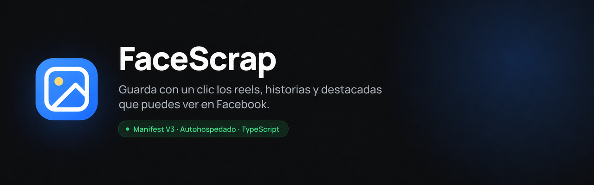
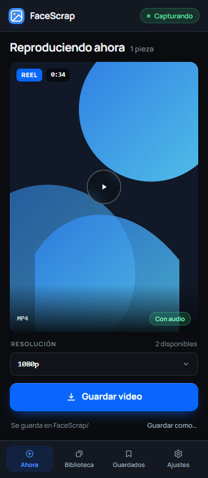
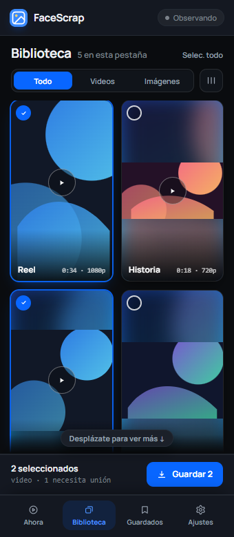
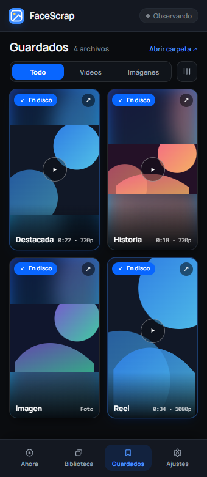
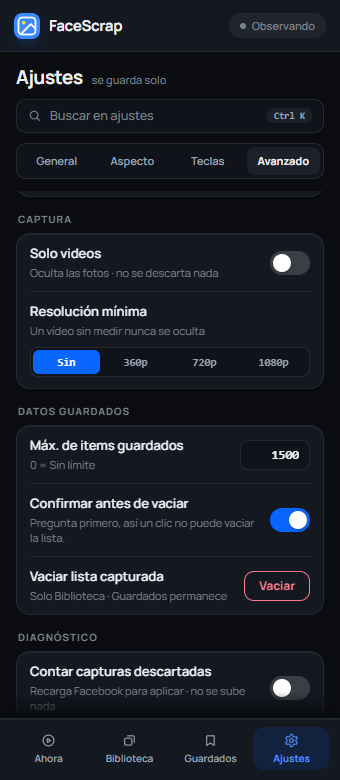
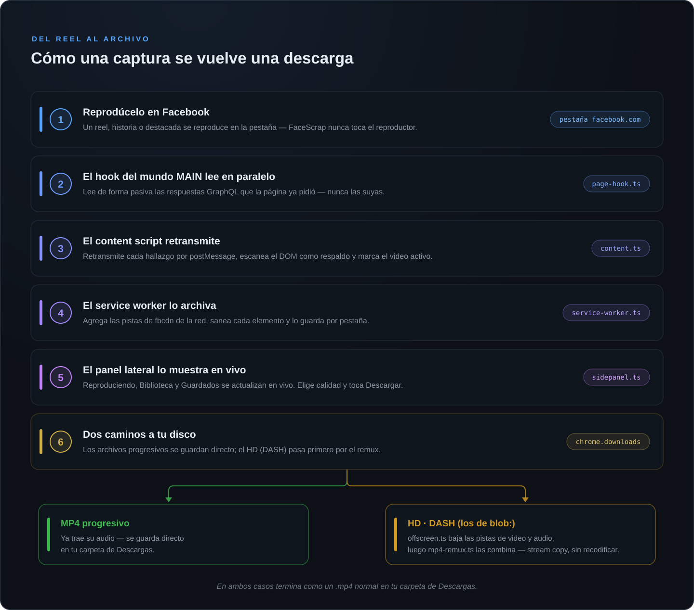

# FaceScrap

[English](README.md) · **Español (México)**

<p align="center">
  
</p>

[](https://github.com/Hydza/FaceScrap/actions/workflows/ci.yaml)
[](https://github.com/Hydza/FaceScrap/releases/latest)
[](manifest.json)
[](#compatibilidad-con-navegadores-chromium)
[](package.json)
[](LICENSE)

FaceScrap es una extensión Manifest V3 de instalación manual para guardar reels,
historias, destacadas y otros medios ya disponibles en tu sesión de Facebook.
No incluye analítica ni un servicio propio; el procesamiento y las descargas
permanecen en tu dispositivo.

> Usa FaceScrap únicamente con contenido propio o que tengas autorización para
> descargar. FaceScrap es un proyecto independiente y no está afiliado ni
> respaldado por Meta o Facebook. Los cambios de la plataforma pueden afectar la
> captura; consulta la [versión más reciente](https://github.com/Hydza/FaceScrap/releases/latest)
> antes de reportar un problema.

**[Inicio rápido](#inicio-rápido) · [Privacidad](PRIVACY.es.md) ·
[Arquitectura](ARCHITECTURE.md) · [Contribuir](CONTRIBUTING.es.md) ·
[Seguridad](SECURITY.md) · [Cambios](CHANGELOG.md)**

<p align="center">
  
  
  
  
</p>
<p align="center"><i>Ahora · Biblioteca · Guardados · Ajustes</i></p>

## Inicio rápido

1. Descarga y extrae el ZIP de la
   [versión más reciente](https://github.com/Hydza/FaceScrap/releases/latest), o
   compílalo desde el código con `npm ci && npm run build`.
2. Abre `chrome://extensions`, activa el **Modo de desarrollador** y elige
   **Cargar sin empaquetar**.
3. Selecciona la carpeta extraída o `dist/`, abre una pestaña de `facebook.com`
   y pulsa el icono de FaceScrap en la barra.

Las extensiones sin empaquetar no se actualizan automáticamente. Repite estos
pasos cuando haya una versión nueva.

## Funciones

- Sigue el reel, historia, destacada, video o imagen visible en la pestaña activa.
- Guarda medios progresivos directamente y combina pistas DASH compatibles de
  video y audio sin recodificar.
- Incluye las vistas Ahora, Biblioteca, Guardados y Ajustes con buscador en un
  panel lateral persistente.
- Ofrece interfaz en inglés y español, atajos, plantillas de nombre, selector de
  calidad, diseños adaptables y temas claro/oscuro.
- Mantiene las capturas, preferencias y diagnósticos dentro del perfil local del
  navegador.

## Privacidad y permisos

| Acceso | Por qué lo necesita FaceScrap |
|--------|--------------------------------|
| `facebook.com` | Detectar medios visibles y leer respuestas que la página ya solicitó |
| `fbcdn.net` | Identificar y descargar archivos y pistas DASH compatibles |
| `storage` | Conservar capturas por pestaña, ajustes, estado guardado y diagnósticos limitados |
| `downloads` | Guardar medios e informes de diagnóstico exportados |
| `webRequest`, `webNavigation`, `scripting` | Observar solicitudes y mantener la captura activa durante la navegación |
| `declarativeNetRequest` | Fijar el referente requerido en las descargas |
| `offscreen`, `sidePanel` | Combinar pistas compatibles y mostrar la interfaz persistente |

FaceScrap no opera un servidor ni sube los medios capturados. Los diagnósticos se
guardan en `chrome.storage.local`, tienen límites y solo se exportan manualmente
desde Ajustes → Avanzado. Consulta [Privacidad](PRIVACY.es.md) para conocer el
tratamiento completo de datos.

## Cómo funciona

1. Un **service worker** observa el tráfico de red hacia `*.fbcdn.net`
   (webRequest no bloqueante) y registra el contenido por pestaña en
   `chrome.storage.session`.
2. Un **hook del mundo MAIN** (`page-hook.js`) lee de forma pasiva las respuestas
   GraphQL que el propio Facebook solicita. Nunca reenvía consultas `doc_id`;
   solo extrae campos como `playable_url` e `image.uri` de respuestas ya presentes
   en la página.
3. Un **content script** aislado escanea el DOM (`<video>`, ``, poster) como
   respaldo y retransmite todo al service worker.
4. El **panel lateral** presenta las capturas de la pestaña activa en tres vistas
   — Ahora, Biblioteca, Guardados — y descarga mediante `chrome.downloads`
   (a los videos HD se les une el audio en un documento offscreen).
   **Ahora** se centra en el contenido que estás viendo: su portada bajo los
   chips de tipo y duración, su contenedor y proporción en la línea sobre el
   medio, un selector de resolución que flota encima del vídeo y solo lista las
   representaciones que el manifiesto realmente ofrece, y un único botón Guardar.
   **Biblioteca** es una cuadrícula de tiles 9:16 con todo lo capturado en la
   pestaña, con subfiltros Todo/Videos/Imágenes y un control de densidad. Un tile
   hace una sola cosa —seleccionar— y seleccionar levanta la bandeja que guarda.
   **Guardados** es la misma cuadrícula acotada a lo que ya descargaste de la
   pestaña, con cada tile marcado «En disco». Ajustes es el cuarto elemento de la
   barra: cuatro páginas con buscador, que contienen el botón Vaciar y el
   interruptor de idioma EN|ES. El icono de la barra y el panel se habilitan solo
   en pestañas de facebook.com. Al ser un panel lateral y no una ventana
   emergente, permanece abierto mientras los videos se reproducen en la página.

### Ahora

La vista Ahora sigue el video que en verdad estás viendo: en páginas
`/reel/<id>` y `/watch` por el id de video de la URL (cotejado contra las claves
de recurso `efg` que lleva cada representación), en el resto por el contenido
centrado en la ventana visible más las pistas que fbcdn está transmitiendo en ese
momento — puntuado a lo largo de una ventana de tiempo, para que la precarga en
segundo plano de un video vecino no pueda robar el lugar. El video actual sigue
mostrándose mientras está en pausa o inactivo y sobrevive al cambio de pestañas;
pasar al siguiente video o foto lo reemplaza.

### Configuración

El cuarto elemento de la barra abre una hoja a panel completo con un buscador
(`Ctrl K`) sobre cuatro páginas. **General**: calidad (mayor / menor / preguntar
— preguntar abre el diálogo Guardar como), subcarpeta «FaceScrap/», descarga
directa (omite la unión de audio), el botón sobre el vídeo, idioma, tema del
panel (Automático sigue la pestaña activa de Facebook y después el dispositivo;
Claro/Oscuro lo reemplazan) y orden de la lista. **Aspecto**: densidad de la
rejilla, fondo, familia de esquinas, y una fila de Color con tres grupos de
muestras — 10 acentos sólidos, 13 degradados y 6 tintes de panel que mueven a la
vez el lienzo, las dos superficies y la línea. **Teclas**: el interruptor maestro
y una fila por función asignable. **Avanzado**: plantilla de nombre de archivo
(tokens `{source}`, `{date}`, `{id}`), vista de solo videos, filtro de resolución
mínima, un tope editable de números enteros por pestaña (por defecto 1500 items,
se descartan primero los más viejos; 0 = sin límite), confirmar antes de vaciar,
y una sola acción de **diagnóstico**: un botón Exportar informe que escribe en un
solo archivo JSON los contadores y el registro, que están siempre activos
(ver [Diagnóstico](#diagnóstico)).

## Qué es confiable y qué no

| Contenido | Confiabilidad | Nota |
|-----------|---------------|------|
| Reels/videos con un `playable_url` progresivo | 🟢 alta | MP4 con audio, descarga directa |
| Videos **HD / solo DASH** (los de `blob:`) | 🟢 alta | Se reconstruyen combinando las pistas de video+audio (remux, **sin recodificar**) |
| Historias / destacadas (imagen + video) | 🟡 media | Requieren tu sesión; las destacadas son más estables |
| Videos con **DRM (Widevine)** | ⛔ sin soporte | Los medios cifrados quedan fuera del alcance de FaceScrap |
| Videos muy largos (cientos de MB) | 🟡 media | El remux en memoria puede quedarse sin RAM |

### Cómo se descargan con audio los videos `blob:`

El `blob:` que ves **no es un archivo** — es un manejador de MSE y no puede leerse.
Pero los **segmentos DASH** que el reproductor descarga sí viajan por la red.
FaceScrap:

1. Lee las URL de la **pista de video** y la **pista de audio** del propio GraphQL
   de Facebook (`all_video_dash_prefetch_representations` / `dash_manifest_xml`).
2. Vuelve a descargar ambas pistas completas desde `fbcdn` (en el documento
   offscreen, que evita CORS gracias a `host_permissions`).
3. **Las combina en un solo MP4** con el remuxer del repo (`src/shared/mp4-remux.ts`)
   — **sin recodificar, sin captura de pantalla**; `-shortest` recorta la unión a
   la pista más corta (por lo general milisegundos) para que el archivo nunca
   termine en video congelado o silencio.

Las entradas `<ContentProtection>` (DRM) se detectan y descartan: no pueden
descifrarse.

## Desarrollo

`npm run dev` recompila al guardar, `npm run check` ejecuta lint, verificación de
tipos, un build limpio y la suite de pruebas, y `npm run build` produce el
`dist/` cargable. `npm run package` ejecuta ese gate completo, recompila desde
cero y escribe el `FaceScrap-vX.Y.Z.zip` que sirve la página de Releases.

El QA visual público del panel lateral se ejecuta en un perfil temporal del
navegador después de compilar:

```powershell
npm run build
npm run qa:sidepanel -- --browser=cft --lang=es --theme=light
```

`--browser` acepta `cft` (Chrome for Testing, predeterminado), `edge` o `brave`;
`--lang` acepta `en` o `es`; y `--theme` acepta `light` (predeterminado), `dark`
o `auto`. La versión fijada de Chrome for Testing se instala al primer uso y se
guarda en caché fuera del repositorio; Edge y Brave usan sus rutas estándar de
Windows. Chrome con marca se excluye de las pruebas automáticas porque las
versiones actuales restringen la carga de extensiones sin empaquetar por línea
de comandos. El flujo
recorre claro → oscuro → automático mediante una página sintética de Facebook
sin red, valida los anchos 300, 340 y 500 px, y restaura el tema solicitado y
el ancho de 340 px antes de escribir las capturas y
`artifacts/qa/<navegador>/<idioma>/<tema>/evidence.json`. `npm run qa:matrix`
conserva por separado la matriz principal de navegador, idioma y tema.
La comparación opcional contra un diseño local sigue disponible con
`--reference ruta\al\archivo.html`.

Para una sesión autenticada de Facebook, conducida por una persona y con
telemetría MV3 continua, ejecuta:

```powershell
npm run build
npm run qa:live
```

Esto abre visiblemente la versión fijada de Chrome for Testing con `dist/` y
un perfil temporal aislado. Inicia sesión, abre FaceScrap desde la barra y usa
Facebook con normalidad; cerrar el navegador termina la sesión y elimina ese
perfil. Las excepciones, errores de consola de la extensión, solicitudes
fallidas de la extensión, ciclos de worker/offscreen/panel, diagnósticos
internos y finalización de descargas se escriben en tiempo real en
`artifacts/live-qa/<sesión>/events.jsonl`. Nunca se guardan cabeceras, cookies,
cuerpos ni parámetros firmados de las URL. Usa `--browser=edge` o
`--browser=brave` para compatibilidad, y
`--url=https://www.facebook.com/...` para elegir la superficie inicial.

## Instalación y actualización

Consigue la carpeta de la extensión por cualquiera de las dos vías:

- **Sin herramientas de compilación** — descarga `FaceScrap-vX.Y.Z.zip` desde
  [Releases](https://github.com/Hydza/FaceScrap/releases) y descomprímelo.
- **Desde el código** — instala Node 24.18 o posterior, ejecuta `npm ci` y luego
  `npm run build`; la carpeta es `dist/`.

Luego cárgala en Chrome:

1. Abre `chrome://extensions`
2. Activa el **Modo de desarrollador**
3. **Cargar sin empaquetar** → elige la carpeta de arriba
4. En una pestaña de **facebook.com**, haz clic en el icono de FaceScrap en la
   barra → se abre el **panel lateral** (el icono permanece deshabilitado en otros
   sitios).
5. Con el panel abierto, reproduce un reel/historia/destacada: el contenido
   aparece en vivo. (El panel lateral permanece abierto mientras interactúas con
   la página, a diferencia de una ventana emergente.)

Para actualizar una instalación sin empaquetar, sustituye la carpeta extraída
por la versión nueva, vuelve a `chrome://extensions` y pulsa **Recargar** en
FaceScrap.

## Estructura

<p align="center">
  
</p>

Cada contexto de arriba se apoya en `src/shared/` — el modelo de contenido y los
saneadores, el análisis de DASH, los accesores de almacenamiento, la inferencia de
reproducción, la configuración, i18n y los contratos de mensajes tipados.
`rules/referer-rules.json` es una regla de declarativeNetRequest que fija el
Referer en las solicitudes a fbcdn.

> **Tamaño:** cerca de 820 KB sin empaquetar. La mezcla DASH está implementada
> en `src/shared/mp4-remux.ts`; no se incluye un ejecutable como ffmpeg.
> Manrope se distribuye bajo la OFL de `src/sidepanel/fonts/OFL.txt`.

## Diagnóstico

Los internos de Facebook cambian y cada camino de captura aísla sus fallos para
que el hook no interrumpa la página. Los diagnósticos limitados conservan el
contexto necesario para distinguir una captura omitida de un error de la página
o de la extensión.

Cada contexto anota lo que hizo: qué consulta GraphQL
devolvió cuántos elementos y cuántos pares DASH (y cuál devolvió un error HTTP),
qué peticiones de medios a fbcdn se clasificaron, qué video creyó el detector que
estaba sonando, qué limpió cada navegación y cómo terminó cada descarga y cada
unión. También anota los errores no capturados de la propia página. Los
contadores de capturas descartadas —la mitad más antigua de esta función— corren
al lado.

Ajustes → Avanzado → **Exportar informe** escribe un solo archivo JSON en tu carpeta de descargas: los
contadores, el registro de eventos (como objetos y como líneas legibles), tus
ajustes y las versiones de la extensión y del navegador.

Lo que deliberadamente NO contiene:

- **Ningún cuerpo de respuesta.** Solo su tamaño, el nombre de la consulta y lo
  que se extrajo. Tu feed nunca se escribe en disco.
- **Ninguna firma de fbcdn.** Cada URL se reduce a host + ruta (más el rango de
  bytes DASH) en el momento en que se anota, así que `oh`, `oe`, `_nc_sid` y
  `_nc_ohc` nunca llegan al archivo. Los enlaces que lleva no son enlaces
  utilizables.
- **Ninguna subida, nunca.** El archivo se escribe en local y no va a ningún
  lado hasta que tú lo mandes.

El registro está limitado a 2,000 eventos y 700 KB, descartando primero los más
viejos, y lo dice en el propio registro cuando descarta algo. Los mismos datos
están en la consola del worker (`chrome://extensions` → Inspeccionar vistas:
service worker) con `faceScrapDiag.dump()`, `faceScrapDiag.log()` y
`faceScrapDiag.report()`; esa consola tiene además `faceScrapDiag.reset()`, que es
la única forma de vaciar cualquiera de los dos ahora que Ajustes no tiene botón de
reinicio.

## Hoja de ruta

- Detección de origen más precisa (reel/historia/destacada) a partir del
  `fb_api_req_friendly_name` de cada respuesta GraphQL.
- Barra de progreso del remux (la mezcla es cirugía de tablas, informa un cambio de fase).
- Botón «Descargar todo».

## Compatibilidad con navegadores Chromium

FaceScrap detecta por características las dos APIs que varían entre navegadores
Chromium y se degrada con elegancia:

| Navegador | Interfaz | Combinar audio+video (DASH) |
|-----------|----------|-----------------------------|
| Chrome 116+ | Panel lateral | Sí (offscreen) |
| Edge 116+ | Panel lateral | Sí |
| Brave / Opera / Vivaldi | Panel lateral donde `sidePanel` es compatible; si no, **ventana emergente** | Sí donde `offscreen` es compatible; si no, descarga solo de video con un aviso |

Requiere Chromium **≥ 116** (`minimum_chrome_version`). En navegadores sin
`chrome.sidePanel` el icono de la barra abre la misma interfaz como **ventana
emergente**; sin `chrome.offscreen`, las descargas HD se guardan solo con video y
se muestra un aviso.

La compatibilidad fuera de Chrome es de mejor esfuerzo porque cada proveedor de
Chromium expone estas APIs de forma distinta. Usa los comandos de QA anteriores
cuando hagas cambios para varios navegadores.

## Contribuir y obtener soporte

Lee [CONTRIBUTING.es.md](CONTRIBUTING.es.md) antes de abrir un pull request. Los
reportes deben incluir la versión del navegador, la superficie afectada de
Facebook y, cuando exista, un informe de diagnóstico redactado. No adjuntes
cookies, cuerpos de respuesta, URL firmadas ni medios personales.

Para vulnerabilidades privadas, sigue [SECURITY.md](SECURITY.md). El
comportamiento general y el tratamiento de datos están descritos en
[PRIVACY.es.md](PRIVACY.es.md).

## Licencia

FaceScrap se publica bajo la [Licencia MIT](LICENSE). La fuente Manrope incluida
conserva su [atribución OFL](src/sidepanel/fonts/OFL.txt) separada.
