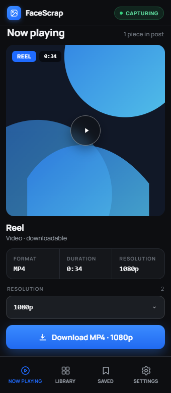
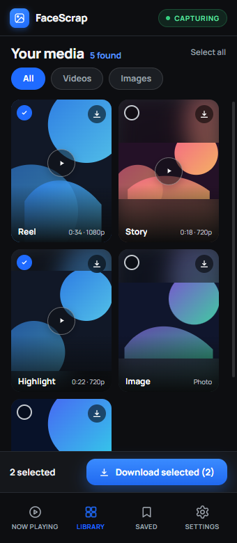
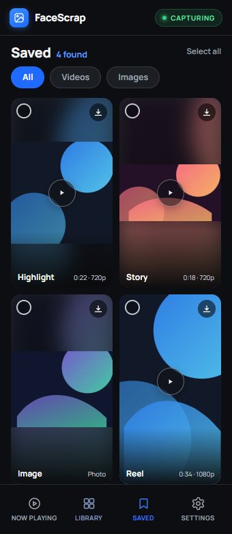
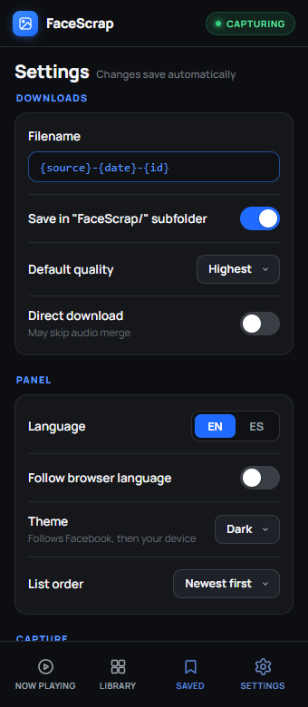
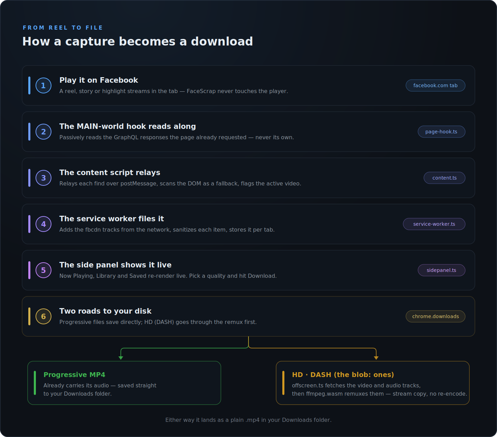

# FaceScrap

**English** · [Español (México)](README.es.md)

<p align="center">
  
</p>

[](https://github.com/Hydza/FaceScrap/actions/workflows/ci.yaml)
[](https://github.com/Hydza/FaceScrap/releases/latest)
[](manifest.json)
[](#chromium-browser-compatibility)
[](package.json)
[](LICENSE)

Save the Facebook **reels, stories and highlights** you can watch, with one click.
Chrome extension (Manifest V3, TypeScript). **Self-hosted** — you build or unzip
it and load it unpacked; it is not on the Chrome Web Store.

> ⚠️ Only download content you have the rights to (your own, or with permission).
> Meta's Terms prohibit automated downloading, so this **can't be published** on
> the Chrome Web Store, and it depends on Facebook internals that change often
> (expect roughly monthly maintenance — watch the
> [Releases](https://github.com/Hydza/FaceScrap/releases) page for updates).

> **What it can access.** Loading FaceScrap grants it a content script on every
> `facebook.com` page (`document_start`) and network access to `facebook.com` and
> `fbcdn.net`. It reads only what those pages already load, stores captures in
> per-tab session storage, and sends nothing to any server of its own. Review
> [the source](src/) before installing — that is the point of self-hosting.

<p align="center">
  
  
  
  
</p>
<p align="center"><i>Now Playing · Library · Saved · Settings</i></p>

## How it works

1. A **service worker** observes network traffic to `*.fbcdn.net` (non-blocking
   webRequest) and records media per tab in `chrome.storage.session`.
2. A **MAIN-world hook** (`page-hook.js`) passively reads the GraphQL responses
   Facebook itself requests (it never re-issues `doc_id` queries, which Meta
   rotates every 2–4 weeks) and extracts `playable_url` (video with audio) and
   `image.uri`.
3. An isolated **content script** scans the DOM (`<video>`, ``, poster) as
   a fallback and relays everything to the service worker.
4. The **side panel** presents the active tab's captures in three views —
   Now Playing, Library, Saved — and downloads via `chrome.downloads` (HD
   videos get their audio merged in an offscreen document). **Now Playing**
   focuses the media you are watching: its cover, format/resolution, duration
   for videos, a quality picker when more than one video resolution exists,
   and one Download.
   **Library** is a card grid of everything captured on the tab, with
   All/Videos/Images sub-filters, a per-card download button, and multi-select
   with a download tray. **Saved** is the same grid narrowed to what you have
   already downloaded from the tab. The gear opens Settings, which also holds
   the Clear button and the EN|ES language toggle. The toolbar icon and panel
   are enabled only on facebook.com tabs. Being a side panel rather than a
   popup, it stays open while videos play on the page.

### Now playing

The Now Playing view tracks the video you are actually watching: on
`/reel/<id>` and `/watch` pages by the URL's video id (matched against the
`efg` asset keys every representation carries), elsewhere by the media
centered in the viewport plus the tracks fbcdn is streaming right now —
scored across a window, so a background prefetch of a neighbouring video
cannot take the slot. The current video stays shown while paused or idle
and survives switching tabs; moving to the next video or photo replaces it.

### Settings

The gear opens a full-panel sheet: filename template (`{source}`, `{date}`,
`{id}` tokens), "FaceScrap/" subfolder, default quality (highest / lowest /
ask — ask opens the Save-As dialog), direct download (skip the audio merge),
follow browser language, panel theme (Auto follows the active Facebook tab,
then the device; Light/Dark override it), list order, confirm before clearing,
videos-only view, minimum-resolution view filter, and an editable whole-number
per-tab retention cap (default 1500 items, oldest evicted first; 0 = unlimited).
Diagnostics adds an off-by-default counter for discarded captures with a reset control.

## What's reliable and what isn't

| Content | Reliability | Note |
|---------|-------------|------|
| Reels/videos with a progressive `playable_url` | 🟢 high | MP4 with audio, direct download |
| **HD / DASH-only** videos (the `blob:` ones) | 🟢 high | Rebuilt by merging the video+audio tracks (remux, **no re-encode**) |
| Stories / highlights (image + video) | 🟡 medium | Require your session; highlights are more stable |
| **DRM (Widevine)** videos | ⛔ no | Encrypted — impossible for any extension |
| Very long videos (hundreds of MB) | 🟡 medium | The in-memory remux can run out of RAM |

### How `blob:` videos are downloaded with audio

The `blob:` you see **is not a file** — it's an MSE handle and cannot be read.
But the **DASH segments** the player downloads do cross the network. FaceScrap:

1. Reads the **video track** and **audio track** URLs from Facebook's own
   GraphQL (`all_video_dash_prefetch_representations` / `dash_manifest_xml`).
2. Re-downloads both complete tracks from `fbcdn` (in the offscreen document,
   which avoids CORS thanks to `host_permissions`).
3. **Merges them into one MP4** with `ffmpeg.wasm` using `-c copy -shortest`
   — **no re-encode, no screen capture**; `-shortest` trims the merge to the
   shorter track (typically milliseconds) so the file never ends on frozen
   video or silence. The same approach yt-dlp uses.

`<ContentProtection>` (DRM) entries are detected and discarded: they cannot be
decrypted.

## Development

`npm run dev` rebuilds on save, `npm run check` runs the type check plus the
unit suite, and `npm run build` produces the loadable `dist/`.

The public side-panel visual QA runs against a temporary browser profile after
the build:

```powershell
npm run build
npm run qa:sidepanel -- --browser=edge --lang=en --theme=light
```

`--browser` accepts `edge` (the default) or `brave`; `--lang` accepts `en` or
`es`; and `--theme` accepts `light` (the default), `dark`, or `auto`. The
harness uses the standard Windows Edge/Brave installation paths, exercises
light → dark → auto theme precedence through a network-free synthetic Facebook
page, checks responsive widths at 300, 340, and 500 px, then restores the
requested theme and 340 px viewport before writing screenshots and
`dist/qa/evidence.json`. An optional local design comparison remains available
with `--reference path\to\reference.html`.

## Install

Get the extension folder either way:

- **No build tools** — download `FaceScrap-vX.Y.Z.zip` from
  [Releases](https://github.com/Hydza/FaceScrap/releases) and extract it.
- **From source** — `npm install`, then `npm run build`; the folder is `dist/`.

Then load it in Chrome:

1. Open `chrome://extensions`
2. Enable **Developer mode**
3. **Load unpacked** → select the folder from above
4. On a **facebook.com** tab, click the FaceScrap toolbar icon → the **side
   panel** opens (the icon stays disabled on other sites).
5. With the panel open, play a reel/story/highlight: media appears live. (The
   side panel stays open while you interact with the page, unlike a popup.)

## Structure

<p align="center">
  
</p>

Every context above is backed by `src/shared/` — the media model and sanitizers,
DASH parsing, storage accessors, now-playing inference, settings, i18n and the
typed message contracts. `rules/referer-rules.json` is a declarativeNetRequest
rule that sets the Referer on fbcdn requests.

> **Size:** the `ffmpeg.wasm` core (~31 MB) is copied into `dist/assets/ffmpeg/`,
> so the unpacked extension weighs ~31 MB. Normal for personal use.

## Roadmap

- More precise source detection (reel/story/highlight) from each GraphQL
  response's `fb_api_req_friendly_name`.
- Remux progress bar (`progress` messages from ffmpeg.wasm).
- "Download all" button.

## Chromium browser compatibility

FaceScrap feature-detects the two APIs that vary across Chromium browsers and
degrades gracefully:

| Browser | UI | Merge audio+video (DASH) |
|---------|----|--------------------------|
| Chrome 116+ | Side panel | Yes (offscreen) |
| Edge 116+ | Side panel | Yes |
| Brave / Opera / Vivaldi | Side panel where `sidePanel` is supported, otherwise **popup** | Yes where `offscreen` is supported; otherwise video-only download with a notice |

Requires Chromium **≥ 116** (`minimum_chrome_version`). On browsers without
`chrome.sidePanel` the toolbar icon opens the same UI as a **popup**; without
`chrome.offscreen`, HD downloads save video-only and a notice is shown.
