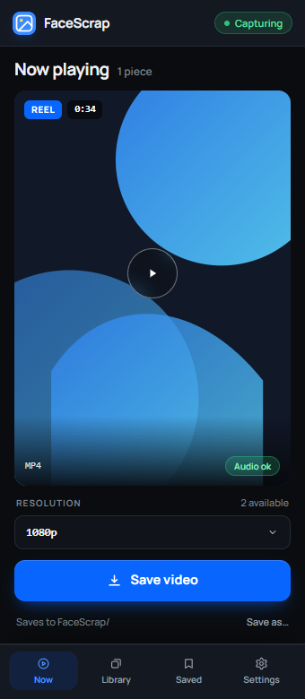
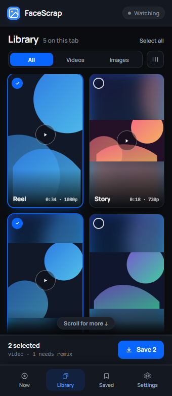
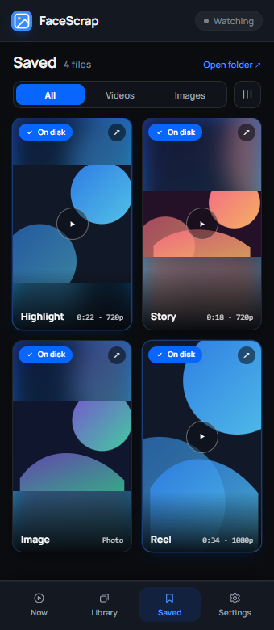
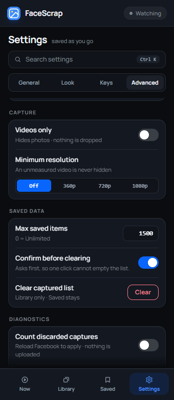
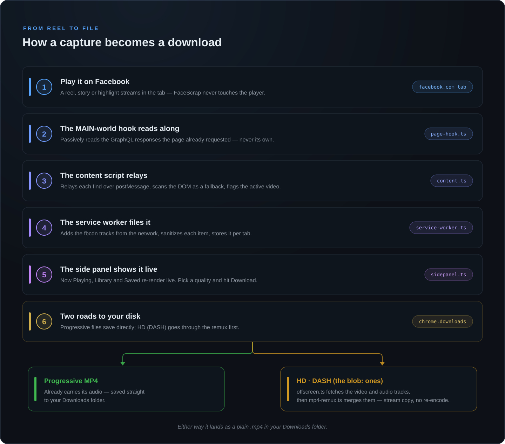

# FaceScrap

**English** · [Español (México)](README.es.md)

<p align="center">
  
</p>

[](https://github.com/Hydza/FaceScrap/actions/workflows/ci.yaml)
[](https://github.com/Hydza/FaceScrap/releases/latest)
[](manifest.json)
[](#chromium-browser-compatibility)
[](package.json)
[](LICENSE)

Save the Facebook **reels, stories and highlights** you can watch, with one click.
Chrome extension (Manifest V3, TypeScript). **Self-hosted** — you build or unzip
it and load it unpacked; it is not on the Chrome Web Store.

> ⚠️ Only download content you have the rights to (your own, or with permission).
> Meta's Terms prohibit automated downloading, so this **can't be published** on
> the Chrome Web Store, and it depends on Facebook internals that change often
> (expect roughly monthly maintenance — watch the
> [Releases](https://github.com/Hydza/FaceScrap/releases) page for updates).

> **What it can access.** Loading FaceScrap grants it a content script on every
> `facebook.com` page (`document_start`) and network access to `facebook.com` and
> `fbcdn.net`. It reads only what those pages already load, stores captures in
> per-tab session storage, and sends nothing to any server of its own. Review
> [the source](src/) before installing — that is the point of self-hosting.

<p align="center">
  
  
  
  
</p>
<p align="center"><i>Now Playing · Library · Saved · Settings</i></p>

## How it works

1. A **service worker** observes network traffic to `*.fbcdn.net` (non-blocking
   webRequest) and records media per tab in `chrome.storage.session`.
2. A **MAIN-world hook** (`page-hook.js`) passively reads the GraphQL responses
   Facebook itself requests (it never re-issues `doc_id` queries, which Meta
   rotates every 2–4 weeks) and extracts `playable_url` (video with audio) and
   `image.uri`.
3. An isolated **content script** scans the DOM (`<video>`, ``, poster) as
   a fallback and relays everything to the service worker.
4. The **side panel** presents the active tab's captures in three views —
   Now Playing, Library, Saved — and downloads via `chrome.downloads` (HD
   videos get their audio merged in an offscreen document). **Now Playing**
   focuses the media you are watching: its cover under a kind and duration
   chip, its container and aspect on the overlay line, a resolution picker that
   floats over the media and lists only the representations the manifest
   actually offers, and one Save.
   **Library** is a 9:16 tile grid of everything captured on the tab, with
   All/Videos/Images sub-filters and a density control. A tile does one thing —
   it selects — and selecting raises the tray that saves the picks. **Saved** is
   the same grid narrowed to what you have already downloaded from the tab,
   each tile badged "On disk". Settings is the fourth nav item: four searchable
   pages holding the Clear button and the EN|ES toggle. The toolbar icon and
   panel are enabled only on facebook.com tabs. Being a side panel rather than
   a popup, it stays open while videos play on the page.

### Now playing

The Now Playing view tracks the video you are actually watching: on
`/reel/<id>` and `/watch` pages by the URL's video id (matched against the
`efg` asset keys every representation carries), elsewhere by the media
centered in the viewport plus the tracks fbcdn is streaming right now —
scored across a window, so a background prefetch of a neighbouring video
cannot take the slot. The current video stays shown while paused or idle
and survives switching tabs; moving to the next video or photo replaces it.

### Settings

The fourth nav item opens a full-panel sheet with a search box (`Ctrl K`) over
four pages. **General**: quality (highest / lowest / ask — ask opens the Save-As
dialog), "FaceScrap/" subfolder, direct download (skip the audio merge), the
in-page button, language, panel theme (Auto follows the active Facebook tab,
then the device; Light/Dark override it) and list order. **Look**: grid density,
backdrop, corner family, and one Colour row of three swatch groups — 10 solid
accents, 13 gradient accents, and 6 panel tints that move the canvas, both
surfaces and the hairline together. **Keys**: the master switch and one row per
bindable function. **Advanced**: filename template (`{source}`, `{date}`, `{id}`
tokens), videos-only view, minimum-resolution filter, an editable whole-number
per-tab retention cap (default 1500 items, oldest evicted first; 0 = unlimited),
confirm before clearing, and the off-by-default **diagnostics** switch — counters
for discarded captures plus an event log of what each context actually did, with
an Export report button that writes the whole thing to one JSON file
(see [Diagnostics](#diagnostics)).

## What's reliable and what isn't

| Content | Reliability | Note |
|---------|-------------|------|
| Reels/videos with a progressive `playable_url` | 🟢 high | MP4 with audio, direct download |
| **HD / DASH-only** videos (the `blob:` ones) | 🟢 high | Rebuilt by merging the video+audio tracks (remux, **no re-encode**) |
| Stories / highlights (image + video) | 🟡 medium | Require your session; highlights are more stable |
| **DRM (Widevine)** videos | ⛔ no | Encrypted — impossible for any extension |
| Very long videos (hundreds of MB) | 🟡 medium | The in-memory remux can run out of RAM |

### How `blob:` videos are downloaded with audio

The `blob:` you see **is not a file** — it's an MSE handle and cannot be read.
But the **DASH segments** the player downloads do cross the network. FaceScrap:

1. Reads the **video track** and **audio track** URLs from Facebook's own
   GraphQL (`all_video_dash_prefetch_representations` / `dash_manifest_xml`).
2. Re-downloads both complete tracks from `fbcdn` (in the offscreen document,
   which avoids CORS thanks to `host_permissions`).
3. **Merges them into one MP4** with the in-repo remuxer (`src/shared/mp4-remux.ts`)
   — **no re-encode, no screen capture**; `-shortest` trims the merge to the
   shorter track (typically milliseconds) so the file never ends on frozen
   video or silence. The same approach yt-dlp uses.

`<ContentProtection>` (DRM) entries are detected and discarded: they cannot be
decrypted.

## Development

`npm run dev` rebuilds on save, `npm run check` runs the type check plus the
unit suite, and `npm run build` produces the loadable `dist/`. `npm run package`
rebuilds from scratch and writes the `FaceScrap-vX.Y.Z.zip` the Releases page serves.

The public side-panel visual QA runs against a temporary browser profile after
the build:

```powershell
npm run build
npm run qa:sidepanel -- --browser=edge --lang=en --theme=light
```

`--browser` accepts `edge` (the default) or `brave`; `--lang` accepts `en` or
`es`; and `--theme` accepts `light` (the default), `dark`, or `auto`. The
harness uses the standard Windows Edge/Brave installation paths, exercises
light → dark → auto theme precedence through a network-free synthetic Facebook
page, checks responsive widths at 300, 340, and 500 px, then restores the
requested theme and 340 px viewport before writing screenshots and
`artifacts/qa/evidence.json`. An optional local design comparison remains available
with `--reference path\to\reference.html`.

## Install

Get the extension folder either way:

- **No build tools** — download `FaceScrap-vX.Y.Z.zip` from
  [Releases](https://github.com/Hydza/FaceScrap/releases) and extract it.
- **From source** — `npm install`, then `npm run build`; the folder is `dist/`.

Then load it in Chrome:

1. Open `chrome://extensions`
2. Enable **Developer mode**
3. **Load unpacked** → select the folder from above
4. On a **facebook.com** tab, click the FaceScrap toolbar icon → the **side
   panel** opens (the icon stays disabled on other sites).
5. With the panel open, play a reel/story/highlight: media appears live. (The
   side panel stays open while you interact with the page, unlike a popup.)

## Structure

<p align="center">
  
</p>

Every context above is backed by `src/shared/` — the media model and sanitizers,
DASH parsing, storage accessors, now-playing inference, settings, i18n and the
typed message contracts. `rules/referer-rules.json` is a declarativeNetRequest
rule that sets the Referer on fbcdn requests.

> **Size:** ~820 KB unpacked, all of it built from `src/` — no vendored binaries.
> The DASH merge is `src/shared/mp4-remux.ts`, not a bundled ffmpeg build.

## Diagnostics

Facebook's internals move, and every capture path here swallows its own failures
on purpose — the page hook must never break the page it runs in. That makes
"nothing was captured" and "the page broke" look identical. Settings → Advanced →
**Record diagnostics** turns on the trace that tells them apart.

While it is on, each context records what it did: which GraphQL query returned
how many items and DASH pairs (and which returned an HTTP error), which fbcdn
media requests were classified, which video the detector believed was playing,
what each navigation cleared, and how every download and remux ended. It also
records the page's own uncaught errors. Counters for discarded captures — the
older half of this feature — keep working alongside it.

**Export report** writes one JSON file to your Downloads folder: the counters,
the event log (as objects and as readable lines), your settings, and the
extension and browser versions.

What it deliberately does not contain:

- **No response bodies.** Only their size, their query name, and what was
  extracted. Your feed is never written to disk.
- **No fbcdn signatures.** Every URL is reduced to host + path (plus the DASH
  byte range) at the moment it is recorded, so `oh`, `oe`, `_nc_sid` and
  `_nc_ohc` never reach the file. The links in it are not usable links.
- **No upload, ever.** The file is written locally and goes nowhere until you
  send it somewhere.

The log is capped at 2 000 events and ~700 KB, oldest dropped first, and says so
in the trace when it drops any. Turning the switch off clears both the counters
and the log. The same data is reachable from the worker console
(`chrome://extensions` → Inspect views: service worker) via
`faceScrapDiag.dump()`, `faceScrapDiag.log()` and `faceScrapDiag.report()`.

## Roadmap

- More precise source detection (reel/story/highlight) from each GraphQL
  response's `fb_api_req_friendly_name`.
- Remux progress bar (the merge is table surgery, so it reports one phase change).
- "Download all" button.

## Chromium browser compatibility

FaceScrap feature-detects the two APIs that vary across Chromium browsers and
degrades gracefully:

| Browser | UI | Merge audio+video (DASH) |
|---------|----|--------------------------|
| Chrome 116+ | Side panel | Yes (offscreen) |
| Edge 116+ | Side panel | Yes |
| Brave / Opera / Vivaldi | Side panel where `sidePanel` is supported, otherwise **popup** | Yes where `offscreen` is supported; otherwise video-only download with a notice |

Requires Chromium **≥ 116** (`minimum_chrome_version`). On browsers without
`chrome.sidePanel` the toolbar icon opens the same UI as a **popup**; without
`chrome.offscreen`, HD downloads save video-only and a notice is shown.
