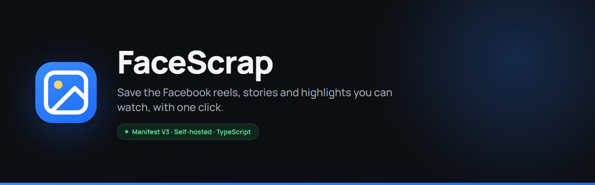

# FaceScrap

**English** · [Español (México)](README.es.md)

<p align="center">
  
</p>

[](https://github.com/Hydza/FaceScrap/actions/workflows/ci.yaml)
[](https://github.com/Hydza/FaceScrap/releases/latest)
[](manifest.json)
[](#chromium-browser-compatibility)
[](package.json)
[](LICENSE)

FaceScrap is a manually installed Manifest V3 extension for saving reels,
stories, highlights, and other media already available in your Facebook
session. It has no analytics or backend service; processing and downloads stay
on your device.

> Use FaceScrap only with content you own or are authorized to download.
> FaceScrap is an independent project and is not affiliated with or endorsed by
> Meta or Facebook. Platform changes can affect capture behavior, so check the
> [latest release](https://github.com/Hydza/FaceScrap/releases/latest) before
> reporting an issue.

**[Quick start](#quick-start) · [Privacy](PRIVACY.md) ·
[Architecture](ARCHITECTURE.md) · [Contributing](CONTRIBUTING.md) ·
[Security](SECURITY.md) · [Changelog](CHANGELOG.md)**

<p align="center">
  
  
  
  
</p>
<p align="center"><i>Now Playing · Library · Saved · Settings</i></p>

## Quick start

1. Download and extract the ZIP from the
   [latest release](https://github.com/Hydza/FaceScrap/releases/latest), or build
   it from source with `npm ci && npm run build`.
2. Open `chrome://extensions`, enable **Developer mode**, and choose
   **Load unpacked**.
3. Select the extracted folder or `dist/`, open a `facebook.com` tab, and click
   the FaceScrap toolbar icon.

Unpacked extensions do not update automatically. Repeat the first three steps
when a new release is available.

## Features

- Tracks the reel, story, highlight, video, or image currently visible in the
  active tab.
- Saves progressive media directly and combines compatible DASH video and audio
  tracks without re-encoding.
- Provides Now Playing, Library, Saved, and searchable Settings views in a
  persistent side panel.
- Includes English and Spanish UI, keyboard shortcuts, filename templates,
  quality selection, responsive layouts, and light/dark themes.
- Keeps captures, preferences, and diagnostics local to the browser profile.

## Privacy and permissions

| Access | Why FaceScrap needs it |
|--------|------------------------|
| `facebook.com` | Detect visible media and read responses the page already requested |
| `fbcdn.net` | Identify and download media files and compatible DASH tracks |
| `storage` | Keep per-tab captures, settings, saved state, and bounded diagnostics |
| `downloads` | Save media and exported diagnostic reports |
| `webRequest`, `webNavigation`, `scripting` | Observe media requests and keep page capture active across navigation |
| `declarativeNetRequest` | Set the required referrer on media downloads |
| `offscreen`, `sidePanel` | Combine compatible tracks and present the persistent interface |

FaceScrap does not operate a server or upload captured media. Diagnostic data is
stored in `chrome.storage.local`, is bounded, and can be exported manually from
Settings → Advanced. See [Privacy](PRIVACY.md) for the complete data-handling
description.

## How it works

1. A **service worker** observes network traffic to `*.fbcdn.net` (non-blocking
   webRequest) and records media per tab in `chrome.storage.session`.
2. A **MAIN-world hook** (`page-hook.js`) passively reads the GraphQL responses
   Facebook itself requests. It never re-issues `doc_id` queries; it only
   extracts media fields such as `playable_url` and `image.uri` from responses
   already present on the page.
3. An isolated **content script** scans the DOM (`<video>`, ``, poster) as
   a fallback and relays everything to the service worker.
4. The **side panel** presents the active tab's captures in three views —
   Now Playing, Library, Saved — and downloads via `chrome.downloads` (HD
   videos get their audio merged in an offscreen document). **Now Playing**
   focuses the media you are watching: its cover under a kind and duration
   chip, its container and aspect on the overlay line, a resolution picker that
   floats over the media and lists only the representations the manifest
   actually offers, and one Save.
   **Library** is a 9:16 tile grid of everything captured on the tab, with
   All/Videos/Images sub-filters and a density control. A tile does one thing —
   it selects — and selecting raises the tray that saves the picks. **Saved** is
   the same grid narrowed to what you have already downloaded from the tab,
   each tile badged "On disk". Settings is the fourth nav item: four searchable
   pages holding the Clear button and the EN|ES toggle. The toolbar icon and
   panel are enabled only on facebook.com tabs. Being a side panel rather than
   a popup, it stays open while videos play on the page.

### Now playing

The Now Playing view tracks the video you are actually watching: on
`/reel/<id>` and `/watch` pages by the URL's video id (matched against the
`efg` asset keys every representation carries), elsewhere by the media
centered in the viewport plus the tracks fbcdn is streaming right now —
scored across a window, so a background prefetch of a neighbouring video
cannot take the slot. The current video stays shown while paused or idle
and survives switching tabs; moving to the next video or photo replaces it.

### Settings

The fourth nav item opens a full-panel sheet with a search box (`Ctrl K`) over
four pages. **General**: quality (highest / lowest / ask — ask opens the Save-As
dialog), "FaceScrap/" subfolder, direct download (skip the audio merge), the
in-page button, language, panel theme (Auto follows the active Facebook tab,
then the device; Light/Dark override it) and list order. **Look**: grid density,
backdrop, corner family, and one Colour row of three swatch groups — 10 solid
accents, 13 gradient accents, and 6 panel tints that move the canvas, both
surfaces and the hairline together. **Keys**: the master switch and one row per
bindable function. **Advanced**: filename template (`{source}`, `{date}`, `{id}`
tokens), videos-only view, minimum-resolution filter, an editable whole-number
per-tab retention cap (default 1500 items, oldest evicted first; 0 = unlimited),
confirm before clearing, and one **diagnostics** action — an Export report button
that writes the always-on counters and event log to one JSON file
(see [Diagnostics](#diagnostics)).

## What's reliable and what isn't

| Content | Reliability | Note |
|---------|-------------|------|
| Reels/videos with a progressive `playable_url` | 🟢 high | MP4 with audio, direct download |
| **HD / DASH-only** videos (the `blob:` ones) | 🟢 high | Rebuilt by merging the video+audio tracks (remux, **no re-encode**) |
| Stories / highlights (image + video) | 🟡 medium | Require your session; highlights are more stable |
| **DRM (Widevine)** videos | ⛔ unsupported | Encrypted media is outside FaceScrap's scope |
| Very long videos (hundreds of MB) | 🟡 medium | The in-memory remux can run out of RAM |

### How `blob:` videos are downloaded with audio

The `blob:` you see **is not a file** — it's an MSE handle and cannot be read.
But the **DASH segments** the player downloads do cross the network. FaceScrap:

1. Reads the **video track** and **audio track** URLs from Facebook's own
   GraphQL (`all_video_dash_prefetch_representations` / `dash_manifest_xml`).
2. Re-downloads both complete tracks from `fbcdn` (in the offscreen document,
   which avoids CORS thanks to `host_permissions`).
3. **Merges them into one MP4** with the in-repo remuxer (`src/shared/mp4-remux.ts`)
   — **no re-encode, no screen capture**; `-shortest` trims the merge to the
   shorter track (typically milliseconds) so the file never ends on frozen
   video or silence.

`<ContentProtection>` (DRM) entries are detected and discarded: they cannot be
decrypted.

## Development

`npm run dev` rebuilds on save, `npm run check` runs lint, type checks, a fresh
build and the unit suite, and `npm run build` produces the loadable `dist/`.
`npm run package` runs that full gate, rebuilds from scratch and writes the
`FaceScrap-vX.Y.Z.zip` the Releases page serves.

The public side-panel visual QA runs against a temporary browser profile after
the build:

```powershell
npm run build
npm run qa:sidepanel -- --browser=cft --lang=en --theme=light
```

`--browser` accepts `cft` (Chrome for Testing, the default), `edge` or `brave`;
`--lang` accepts `en` or `es`; and `--theme` accepts `light` (the default),
`dark`, or `auto`. The pinned Chrome for Testing version is installed on first
use and cached outside the repository; Edge and Brave use their standard Windows
installation paths. Branded Chrome is deliberately excluded from automated runs
because current releases restrict command-line loading of unpacked extensions.
The harness exercises
light → dark → auto theme precedence through a network-free synthetic Facebook
page, checks responsive widths at 300, 340, and 500 px, then restores the
requested theme and 340 px viewport before writing screenshots and
`artifacts/qa/<browser>/<language>/<theme>/evidence.json`. `npm run qa:matrix`
keeps the primary browser/language/theme results in separate directories.
An optional local design comparison remains available
with `--reference path\to\reference.html`.

For an authenticated, human-driven Facebook session with continuous MV3
telemetry, run:

```powershell
npm run build
npm run qa:live
```

This opens pinned Chrome for Testing visibly with `dist/` and an isolated
temporary profile. Log in, open FaceScrap from the toolbar, and use Facebook
normally; closing the browser ends the session and removes that profile.
Runtime exceptions, extension console errors, failed extension requests,
worker/offscreen/panel lifecycles, internal diagnostics, and browser download
settlement stream to `artifacts/live-qa/<session>/events.jsonl`. Request
headers, cookies, bodies, and signed URL query strings are never persisted.
Use `--browser=edge` or `--browser=brave` for compatibility runs, and
`--url=https://www.facebook.com/...` to choose the starting surface.

## Install and update

Get the extension folder either way:

- **No build tools** — download `FaceScrap-vX.Y.Z.zip` from
  [Releases](https://github.com/Hydza/FaceScrap/releases) and extract it.
- **From source** — install Node 24.18 or newer, run `npm ci`, then `npm run build`;
  the folder is `dist/`.

Then load it in Chrome:

1. Open `chrome://extensions`
2. Enable **Developer mode**
3. **Load unpacked** → select the folder from above
4. On a **facebook.com** tab, click the FaceScrap toolbar icon → the **side
   panel** opens (the icon stays disabled on other sites).
5. With the panel open, play a reel/story/highlight: media appears live. (The
   side panel stays open while you interact with the page, unlike a popup.)

To update an unpacked installation, replace the extracted folder with the new
release, return to `chrome://extensions`, and click **Reload** on FaceScrap.

## Structure

<p align="center">
  
</p>

Every context above is backed by `src/shared/` — the media model and sanitizers,
DASH parsing, storage accessors, now-playing inference, settings, i18n and the
typed message contracts. `rules/referer-rules.json` is a declarativeNetRequest
rule that sets the Referer on fbcdn requests.

> **Size:** about 820 KB unpacked. The DASH merge is implemented in
> `src/shared/mp4-remux.ts`; no executable runtime such as ffmpeg is bundled.
> Manrope is distributed under the OFL in `src/sidepanel/fonts/OFL.txt`.

## Diagnostics

Facebook's internals change, and each capture path isolates its failures so the
page hook does not disrupt the page. Bounded diagnostics record enough context
to distinguish a capture miss from a page or extension error.

Each context records what it did: which GraphQL query returned
how many items and DASH pairs (and which returned an HTTP error), which fbcdn
media requests were classified, which video the detector believed was playing,
what each navigation cleared, and how every download and remux ended. It also
records the page's own uncaught errors. Counters for discarded captures — the
older half of this feature — run alongside it.

Settings → Advanced → **Export report** writes one JSON file to your Downloads folder: the counters,
the event log (as objects and as readable lines), your settings, and the
extension and browser versions.

What it deliberately does not contain:

- **No response bodies.** Only their size, their query name, and what was
  extracted. Your feed is never written to disk.
- **No fbcdn signatures.** Every URL is reduced to host + path (plus the DASH
  byte range) at the moment it is recorded, so `oh`, `oe`, `_nc_sid` and
  `_nc_ohc` never reach the file. The links in it are not usable links.
- **No upload, ever.** The file is written locally and goes nowhere until you
  send it somewhere.

The log is capped at 2,000 events and 700 KB, oldest dropped first, and says so in
the trace when it drops any. The same data is reachable from the worker console
(`chrome://extensions` → Inspect views: service worker) via
`faceScrapDiag.dump()`, `faceScrapDiag.log()` and `faceScrapDiag.report()`; that
console also has `faceScrapDiag.reset()`, which is the only way to clear either
store now that Settings has no reset button.

## Roadmap

- More precise source detection (reel/story/highlight) from each GraphQL
  response's `fb_api_req_friendly_name`.
- Remux progress bar (the merge is table surgery, so it reports one phase change).
- "Download all" button.

## Chromium browser compatibility

FaceScrap feature-detects the two APIs that vary across Chromium browsers and
degrades gracefully:

| Browser | UI | Merge audio+video (DASH) |
|---------|----|--------------------------|
| Chrome 116+ | Side panel | Yes (offscreen) |
| Edge 116+ | Side panel | Yes |
| Brave / Opera / Vivaldi | Side panel where `sidePanel` is supported, otherwise **popup** | Yes where `offscreen` is supported; otherwise video-only download with a notice |

Requires Chromium **≥ 116** (`minimum_chrome_version`). On browsers without
`chrome.sidePanel` the toolbar icon opens the same UI as a **popup**; without
`chrome.offscreen`, HD downloads save video-only and a notice is shown.

Compatibility outside Chrome is best effort because Chromium vendors expose
these extension APIs differently. Use the browser QA commands above when making
cross-browser changes.

## Contributing and support

Read [CONTRIBUTING.md](CONTRIBUTING.md) before opening a pull request. Bug
reports should include the browser version, affected Facebook surface, and a
redacted diagnostic export when available. Do not attach cookies, response
bodies, signed URLs, or personal media.

For private vulnerability reports, follow [SECURITY.md](SECURITY.md). General
behavior and data-handling details are documented in [PRIVACY.md](PRIVACY.md).

## License

FaceScrap is released under the [MIT License](LICENSE). The bundled Manrope font
retains its separate [OFL attribution](src/sidepanel/fonts/OFL.txt).
